<div align="center">
  
</div>

<div align="center">
  
</div>

<div align="center">
  
  
  
</div>

<br/>

## `01 //` PILOT FILE

```text
┌─ PERSONNEL DOSSIER ──────────────────────────────────────┐
│  HANDLE ......... glassHandle                            │
│  NAME ........... Himanshu                               │
│  AFFILIATION .... IIT Jammu — B.Tech CSE · class of '28  │
│  SPECIALTY ...... systems · networks · security · DL     │
│  STATUS ......... building the future                    │
└──────────────────────────────────────────────────────────┘
```

I build things from the ground up — **network protocols without libraries**, **compilers in C**, **Unix shells on raw POSIX** — because understanding a system means being able to rebuild it.

- 🔴 currently deep in **systems programming, web security & machine learning**
- ⚔️ winner — inter-branch **CTF & competitive programming**, IIT Jammu
- 🧠 **1000+ problems** solved on LeetCode
- 🐛 responsibly disclosed a security vulnerability in the IIT Jammu placement portal

## `02 //` UNITS DEPLOYED

| UNIT | PROJECT | STACK | BRIEF |
|:----:|---------|-------|-------|
| `01` | **[content-diffusion-simulator](https://github.com/glassHandle/content-diffusion-simulator)** | `Python · ML` | social-media digital twin — forecasts content reach before publication (BERTopic · UMAP · HDBSCAN) |

## `03 //` ARSENAL

**LANGUAGES**

      

**SYSTEMS & NETWORKING**

     

**SECURITY**

  

**MACHINE LEARNING**

     

**WEB & DATABASES**

       

**TOOLS**

 

## `04 //` TELEMETRY
<div align="center">
  
  
</div>

<div align="center">
  
</div>

<div align="center">
  
</div>

<!-- <div align="center">
  
</div> -->

## `05 //` CONTRIBUTION FEED

<div align="center">
  
</div>

## `06 //` OPEN CHANNEL

<div align="center">
  <a href="mailto:2024UCS0094@iitjammu.ac.in"></a>
  <a href="https://www.linkedin.com/in/himanshu-gill-b69842317"></a>
  <a href="https://leetcode.com/glass_Handle"></a>
</div>

<br/>

<div align="center">
  <sub><code>BUILT FROM SCRATCH. LIKE EVERYTHING ELSE.</code></sub>
</div>
